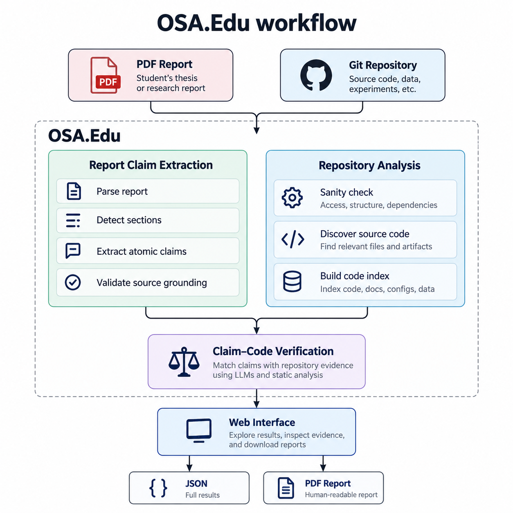
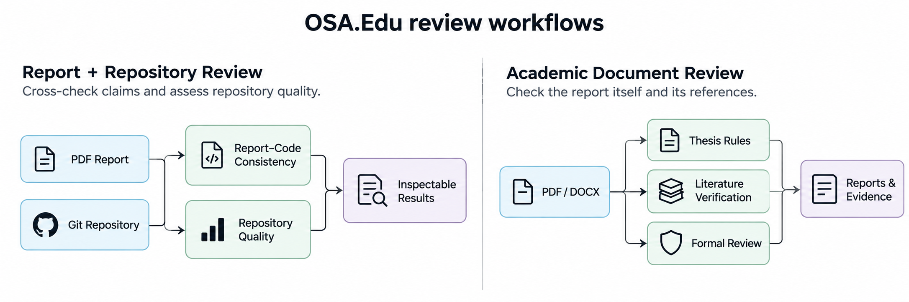
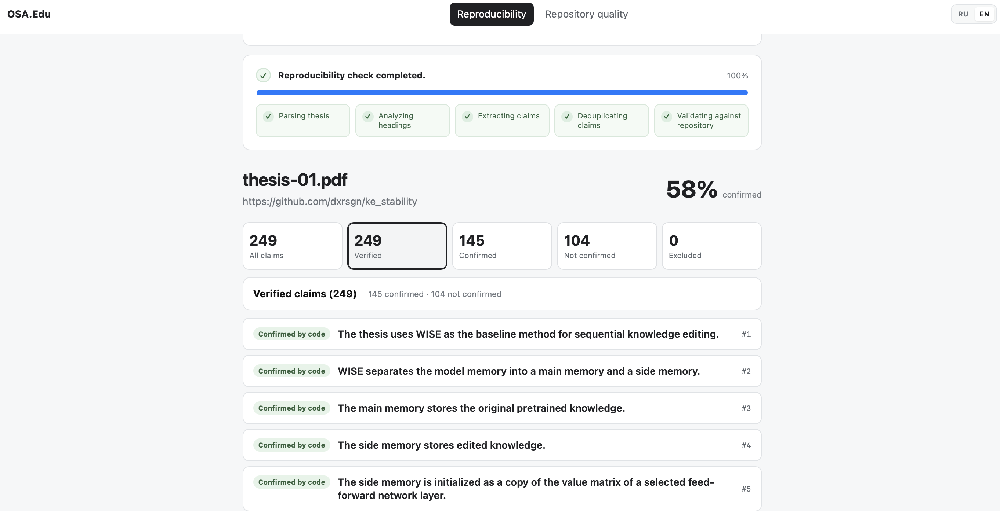

# OSA.Edu: Evidence-Grounded Review of Report-Code Consistency in Student Projects

<p align="center">
  <a href="https://huggingface.co/spaces/tityos/OSA.Edu"></a>
  <a href="https://youtu.be/THQs2RiOc2A"></a>
  
</p>

Official repository for the paper:

> **OSA.Edu: Evidence-Grounded Review of Report-Code Consistency in Student Projects**

- 🖥️ **Live demo:** https://huggingface.co/spaces/tityos/OSA.Edu
- 🎬 **Video:** https://youtu.be/THQs2RiOc2A

---

## Overview

Reviewing a student software project is more than reading the report or browsing the repository in isolation. A reviewer has to connect technical statements in the document with implementation evidence, inspect the quality of the submitted repository, verify bibliography entries, and check formal academic requirements.

**OSA.Edu turns these tasks into inspectable, evidence-grounded workflows.** For the report–code workflow described in the paper, a reviewer supplies only:

1. a **PDF report**,
2. the corresponding **Git repository**.

OSA.Edu extracts source-grounded technical claims from the report, retrieves relevant repository evidence, and verifies the claims one by one. Instead of returning a single opaque score, it exposes the **decision, confidence, explanation, and code evidence** behind each result.



```text
PDF Report + Git Repository
            ↓
Claim Extraction + Repository Analysis
            ↓
      Claim–Code Verification
            ↓
Decision + Confidence + Explanation + Evidence
            ↓
        Web UI / JSON / PDF
```

Beyond report–code consistency, OSA.Edu includes complementary workflows for **repository quality**, **thesis rule checking**, **literature verification**, and **formal norm control**.

---

## How It Works

1. **Source-grounded claim extraction.** The report pipeline parses the PDF, identifies implementation-relevant sections, extracts atomic technical claims, and preserves the source context used to produce each claim. The production workflow is integrated with OSA's paper-analysis pipeline ([`backend/app/reproducibility/`](backend/app/reproducibility/)).

2. **Repository analysis.** OSA analyzes the associated repository and retrieves bounded implementation evidence rather than placing the whole codebase into one verification prompt. Repository-side analysis is reused both for report–code verification and for the dedicated repository-quality workflow ([`backend/app/repository_quality/`](backend/app/repository_quality/)).

3. **Claim–code verification.** Each claim is checked against retrieved repository evidence. The result remains inspectable: the interface exposes the verification status, confidence, explanation, and supporting code fragments instead of hiding the reasoning behind an aggregate score.

4. **Human-facing review.** Results are shown in the browser and can be exported for later inspection. Report–code runs keep job history and technical logs and support retry, stop, and resume operations where applicable.

### Complementary review workflows

The platform keeps the paper's report–code workflow separate from other academic checks, while presenting them in the same interface:



- **Repository Quality.** Evaluates project structure, documentation, development history, entry points, dependencies, tests, data artifacts, experiment scripts, Python syntax, and code documentation. The result includes an overall score, repository type, criterion-level findings, recommendations, logs, and JSON export ([`src/components/RepositoryQualityPage.tsx`](src/components/RepositoryQualityPage.tsx)).

- **Thesis Check.** Builds a semantic **Document Map** from PDF/DOCX input and runs deterministic, structural, candidate-first, and semantic rules. Findings are linked to document evidence and can be exported as user, developer, JSON, or Markdown reports.

- **Literature Verification.** Extracts bibliography entries, normalizes them, checks DOI/arXiv/URL/Crossref evidence, compares metadata, and uses an LLM for ambiguous cases. The workflow is conservative: lack of reliable evidence is reported as `UNVERIFIED`, not automatically as fabrication ([`backend/app/literature/`](backend/app/literature/)).

- **Formal Review / Norm Control.** Sends a PDF to an external Auto Norm Control MCP workflow, tracks attempts and errors, and returns the generated PDF report ([`backend/app/normcontrol/`](backend/app/normcontrol/)).

---

## OSA.Edu Workbench (Demo)

The web interface brings the review workflows into one workspace. Users can launch report–code analysis, evaluate repository quality.

Each workflow has its own job history and result view. Long-running checks expose progress or technical logs, while completed runs surface the evidence needed for human inspection.



Try it live: **https://huggingface.co/spaces/tityos/OSA.Edu** (video walkthrough: https://youtu.be/THQs2RiOc2A).

---

## Installation

Requirements: **Python 3.11–3.14**, **Node.js 20.19+**, npm, and Git.

```bash
git clone https://github.com/ITMO-NSS-team/OSA.Edu.git
cd OSA.Edu

python3 -m venv .venv
source .venv/bin/activate

pip install -r requirements.txt
npm install
```

On Windows PowerShell, activate the environment with:

```powershell
.\.venv\Scripts\Activate.ps1
```

### Configuration

Copy the environment template and fill in the credentials required by the workflows you plan to use:

```bash
cp .env.example .env
```

Minimal API-backed setup:

```dotenv
OPENROUTER_API_KEY=your_api_key
```

Report–code verification can also use the Host LLM adapter:

```dotenv
HOST_LLM_COMMAND=codex
REPRODUCIBILITY_USE_HOST_LLM=true
REPRODUCIBILITY_MODEL=gpt-5.6-luna
```

Selected optional settings:

```dotenv
# Literature verification
LITERATURE_REVIEW_MODEL=gpt-5.6-luna
LITERATURE_WEB_SEARCH_ENABLED=true
CROSSREF_MAILTO=

# External formal review
NORMCONTROL_MCP_URL=
NORMCONTROL_DAG_ID=

# Report-code analysis
REPRODUCIBILITY_TIMEOUT_SECONDS=3600
REPRODUCIBILITY_CONTEXT_WINDOW=65536
REPRODUCIBILITY_MAX_TOKENS=8000
```

The full configuration surface is documented in [`.env.example`](.env.example).

---

## Quick Start

Start the backend and frontend together:

```bash
npm run dev
```

This launches:

```text
FastAPI backend   http://127.0.0.1:8787
React frontend    http://127.0.0.1:5173
```

For the paper's report–code workflow:

1. Open **Reproducibility**.
2. Enter the repository URL.
3. Upload the corresponding PDF report.
4. Start analysis.
5. Inspect individual claims, decisions, confidence, explanations, and repository evidence.
6. Export the result as JSON or use the printable report view.

Other workflows follow the same pattern:

```text
Repository URL                 → Repository Quality
PDF / DOCX                     → Thesis Check
PDF with bibliography          → Literature Verification
PDF + configured MCP endpoint  → Formal Review
```

### Docker development mode

```bash
docker compose -f docker-compose.dev.yml up --build
```

The development Compose setup starts the frontend and backend together and persists backend runtime data in a Docker volume.

---

## Repository Structure

```text
.
├── backend/app/
│   ├── checking/                 # rule execution
│   ├── document/                 # Document Map and structural analysis
│   ├── literature/               # bibliography extraction and verification queue
│   ├── llm/                      # LLM providers and request handling
│   ├── normcontrol/              # external MCP norm-control integration
│   ├── reproducibility/          # OSA paper-analysis / report-code workflow
│   ├── repository_quality/       # OSA repository-quality workflow
│   ├── orchestration/            # thesis-check orchestration
│   ├── routing/                  # rule routing
│   ├── rules/                    # rule loading and execution
│   └── main.py                   # FastAPI application
│
├── src/
│   ├── components/
│   │   ├── CheckPage.tsx
│   │   ├── LiteraturePage.tsx
│   │   ├── NormControlPage.tsx
│   │   ├── ReproducibilityPage.tsx
│   │   ├── RepositoryQualityPage.tsx
│   │   ├── ReportsPage.tsx
│   │   └── RulesPage.tsx
│   ├── api.ts
│   ├── types.ts
│   └── App.tsx
│
├── config/                       # rules, routing, prompts, candidate contracts
├── rules-data/                   # source rule data
├── experiments/aaai_27_demo_track/
├── .codex/skills/osa-edu-review/
├── docs/images/                  # figures used in this README
├── docker/
├── tools/
├── .env.example
├── docker-compose.dev.yml
├── requirements.txt
└── package.json
```

---

## Development

Run the application in development mode:

```bash
npm run dev
```

Useful backend/frontend checks depend on the development environment, but a typical pre-PR pass should include:

```bash
python -m compileall backend
npm run build
```

When changing the thesis rule registry, keep the generated routing/configuration projections synchronized with [`config/rule-manifest.json`](config/rule-manifest.json) and [`tools/sync_rule_projections.py`](tools/sync_rule_projections.py).

---
## Authorship

The initial version of the literature/reference checking subsystem was authored by **Ivan Molodetskikh (MSU)**.

